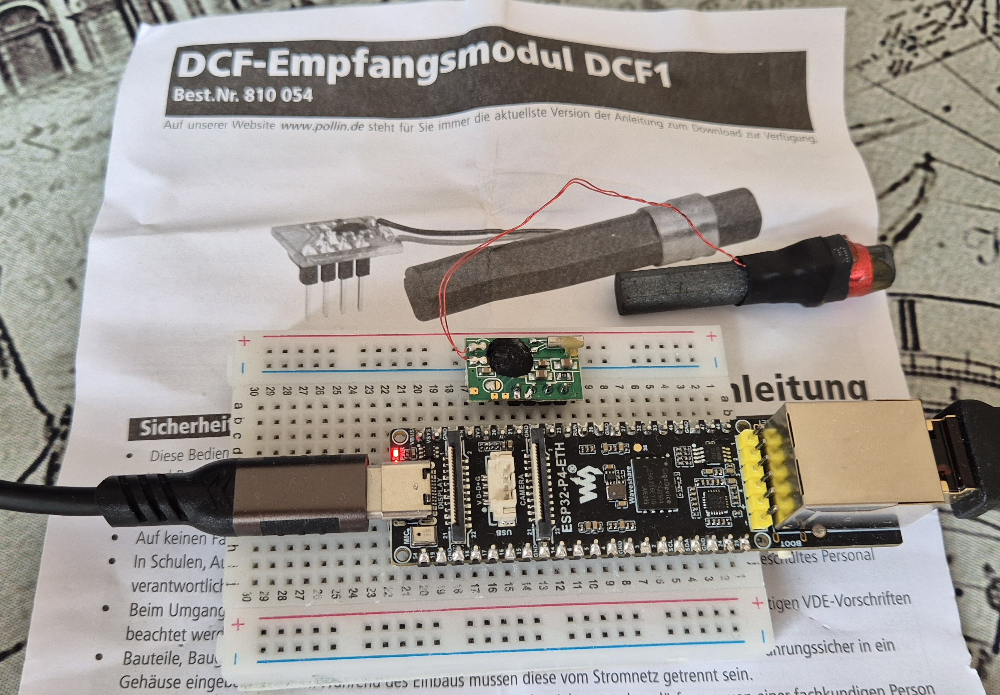

# ESP32 Ethernet DCF77 Project

This project demonstrates basic Ethernet functionality on the ESP32 platform. It includes:

- DHCP configured
- Static IP configuration in commands
- Event handling for Ethernet and IP events
- UDP server example
- DCF77 time signal decoding
- NTP server functionality
- Tested with https://www.waveshare.com/esp32-p4-eth.htm
- DCF77-Modul https://www.pollin.de/p/dcf-empfangsmodul-dcf1-810054
A DCF77 time signal receiver module is connected to an ESP32-P4-ETH development board on a breadboard. The ESP32 board is powered via USB and has an Ethernet cable attached. The DCF77 module is wired with thin red wires and placed next to a cylindrical antenna. The setup rests on a printed instruction sheet with the heading DCF-Empfangsmodul DCF1 Best.Nr. 810 054 and a website link www.pollin.de. The sheet includes safety instructions in German, mentioning responsible handling in schools and separation from the power grid during installation. The environment is a casual workspace with a patterned tablecloth. The tone is technical and focused on electronics experimentation.
- 


## Project Structure
- `main/` – Main application code (Ethernet setup, event handlers)
- `components/` – Custom components (e.g., `ethernet_init`, `dcf77`, `ntp_server`)
- `build/` – Build output (ignored by git)
- `sdkconfig` – Project configuration

## Getting Started
1. Install [ESP-IDF](https://docs.espressif.com/projects/esp-idf/en/latest/esp32/get-started/index.html)
2. Configure your board and network settings in `sdkconfig`
3. Build and flash the project:
   ```sh
   idf.py build
   idf.py flash
   ```
4. Monitor output:
   ```sh
   idf.py monitor
   ```

## Features
- Static IP assignment for Ethernet
- UDP server task (see `udp_socket_server.c`)
- DCF77 time decoding (see `dcf77.c`)
- NTP server example

## Customization
- Adjust IP settings in `main/ethernet_example_main.c`
- Enable/disable features via `sdkconfig`

## License
This project is in the Public Domain.
